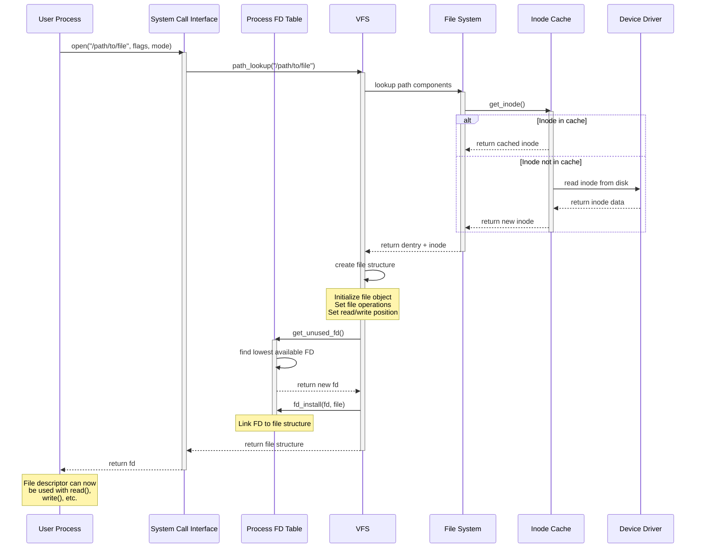
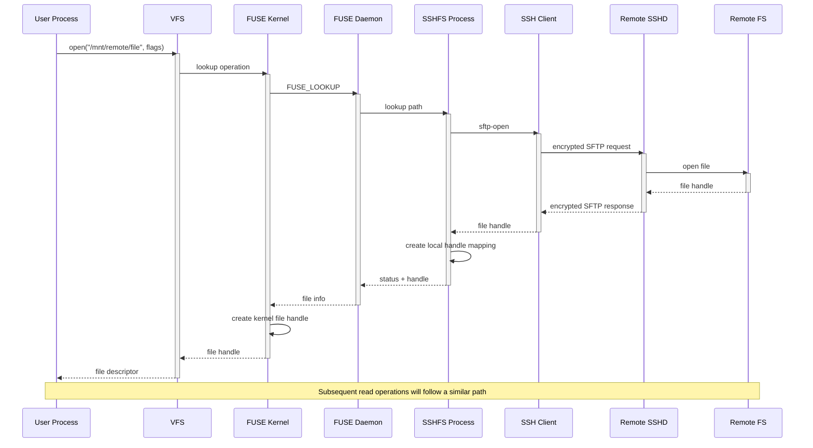
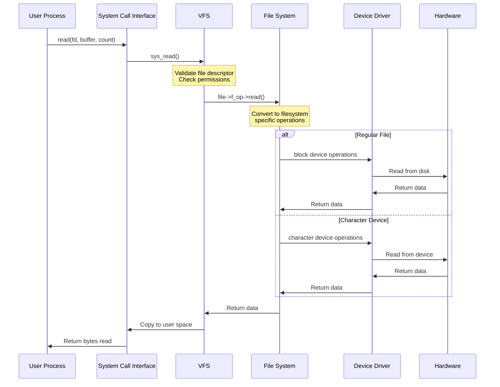
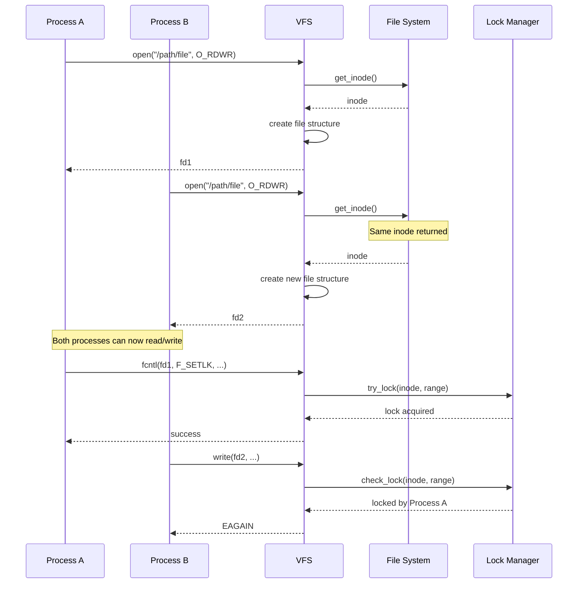
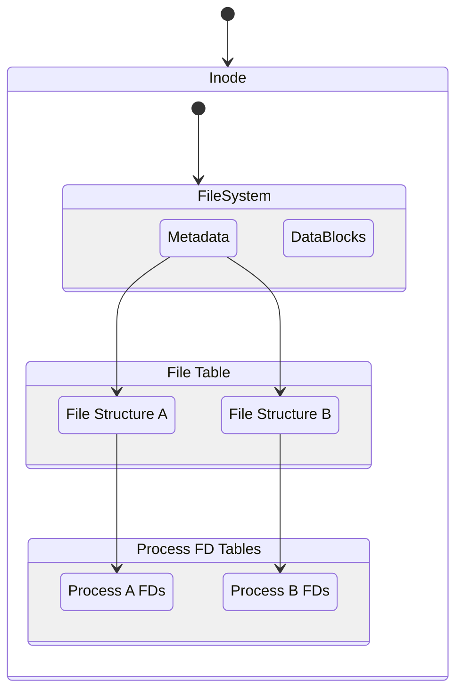

# UL Asset Schema and Common Interface

This document is an attempt to define the core asset schema and the foundational
functions that operate on an asset.  To do this, we have turned to the Linux
file-system for inspiration.  The inode construct forms the inspiration for the
asset schema and the syscall interface forms the inspiration for the
foundational functions that operate on assets.  While we have not included
credentials and documents under the scope for now - we believe they can have
similar parallels.


## Inode Struct
Following is the C struct declaration of the inode data structure with
associated comments.
<details>
<summary>Linux Kernel Inode Struct Declaration</summary>

```c
struct inode {
    unsigned long i_ino;                            // Inode number
    inode_mode i_mode;                              // File type and permissions
    unsigned int i_uid;                             // User ID of the file's owner
    unsigned int i_gid;                             // Group ID of the file's owner
    unsigned long i_size;                           // Size of the file in bytes
    unsigned long i_atime;                          // Last access time
    unsigned long i_mtime;                          // Last modification time
    unsigned long i_ctime;                          // Last status change time
    unsigned long i_blocks;                         // Number of blocks allocated to the file
    unsigned int i_nlink;                           // Number of hard links to the inode
    struct super_block *i_sb;                       // Pointer to the superblock containing this inode
    struct address_space *i_data;                   // Pointer to the data blocks
    inode_flags i_flags;                            // Inode flags (e.g., dirty, locked)
    void *i_private;                                // Private data for filesystem use
    unsigned long i_block[15];                      // Pointers to data blocks (12 direct + 3 indirect)
};

struct super_block {
    unsigned long s_blocksize;                      // Size of blocks in bytes
    unsigned long s_blocksize_bits;                 // Log2(s_blocksize)
    struct block_device *s_bdev;                    // Block device associated with the filesystem
    struct inode *s_root;                           // Root inode of the filesystem
    struct list_head s_list;                        // List of all superblocks
    struct list_head s_dirty;                       // List of dirty superblocks
    struct file_system_type *s_type;                // Filesystem type
    void *s_fs_info;                                // Private data for filesystem use
    struct dquot *s_dquot;                          // Quota information
    super_flags s_flags;                            // Flags for filesystem behavior
    unsigned long s_time_gran;                      // Granularity of timekeeping
    struct rw_semaphore s_umount;                   // Semaphore for unmounting
    struct address_space *s_aops;                   // Address space for page cache management
};

struct address_space {
    struct inode *host;                             // Pointer to the inode this address space belongs to
    struct xarray i_pages;                          // Cached pages associated with this address space
    struct rw_semaphore invalidate_lock;            // Lock for managing invalidation of pages
    unsigned long nrpages;                          // Total number of pages in this address space
    const struct address_space_operations *a_ops;   // Operations for this address space
};

// Block device structure
struct block_device {
    dev_t bd_dev;                                   // Device number
    struct inode *bd_inode;                         // Inode associated with this block device
    struct super_block *bd_super;                   // Superblock associated with this device
    struct mutex bd_mutex;                          // Mutex for synchronization
    struct list_head bd_list;                       // List of all block devices
    blk_flags bd_flags;                             // Block device flags
    struct request_queue *bd_queue;                 // Request queue for I/O operations
    void *bd_private;                               // Private data for driver use
};

// File system type structure
struct file_system_type {
    const char *name;                                               // Name of the filesystem type
    fs_flags fs_flags;                                              // Filesystem flags
    struct super_block *(*mount)(struct file_system_type *, int,
                                const char *, void *);              // Mount operation
    void (*kill_sb)(struct super_block *);                          // Unmount operation
    struct module *owner;                                           // Module owning this filesystem type
    struct list_head fs_supers;                                     // List of superblocks for this type
};

// Disk quota structure
struct dquot {
    struct list_head dq_hash;                       // Hash list entry
    struct list_head dq_inuse;                      // List of used quota entries
    struct list_head dq_free;                       // List of free quota entries
    struct block_device *dq_dev;                    // Device this quota belongs to
    unsigned int dq_id;                             // User or group ID
    unsigned long dq_flags;                         // Flags for this quota
    struct mutex dq_lock;                           // Lock for quota operations
    unsigned long dq_referenced;                    // Reference count
    unsigned long long dq_blocks;                   // Number of blocks used
    unsigned long long dq_block_limit;              // Block limit
    unsigned long long dq_inodes;                   // Number of inodes used
    unsigned long long dq_inode_limit;              // Inode limit
};

// List head structure for linked lists
struct list_head {
    struct list_head *next;
    struct list_head *prev;
};

// Read-write semaphore structure
struct rw_semaphore {
    atomic_long_t count;                            // Counter for read/write access
    struct list_head wait_list;                     // Wait queue
    raw_spinlock_t wait_lock;                       // Spinlock for wait queue
};

// Extended array structure for page cache
struct xarray {
    spinlock_t xa_lock;                             // Lock for array access
    gfp_flags xa_flags;                             // Allocation flags
    void *xa_head;                                  // Root of the array
};

// Mutex structure for synchronization
struct mutex {
    atomic_t count;                                 // Lock count
    spinlock_t wait_lock;                           // Spinlock for wait queue
    struct list_head wait_list;                     // Wait queue
};

// Address space operations
struct address_space_operations {
    int (*writepage)(struct page *page, struct writeback_control *wbc);
    int (*readpage)(struct file *, struct page *);
    int (*writepages)(struct address_space *, struct writeback_control *);
    int (*readpages)(struct file *, struct address_space *,
                     struct list_head *, unsigned);
    void (*invalidatepage)(struct page *, unsigned int, unsigned int);
    int (*releasepage)(struct page *, gfp_t);
    void (*freepage)(struct page *);
    int (*direct_IO)(struct kiocb *, struct iov_iter *iter);
};

// Spinlock structure
typedef struct {
    atomic_t lock;                                  // Lock variable
} raw_spinlock_t;

// Basic type definitions
typedef unsigned long dev_t;                        // Device number type
typedef unsigned gfp_t;                             // Memory allocation flags

// File type and permission bits for i_mode in inode
enum inode_mode {
    // File types
    S_IFMT   = 0170000,                             // Mask for file type
    S_IFREG  = 0100000,                             // Regular file
    S_IFDIR  = 0040000,                             // Directory
    S_IFCHR  = 0020000,                             // Character device
    S_IFBLK  = 0060000,                             // Block device
    S_IFIFO  = 0010000,                             // FIFO (named pipe)
    S_IFLNK  = 0120000,                             // Symbolic link
    S_IFSOCK = 0140000,                             // Socket

    // Permission bits
    S_ISUID  = 0004000,                             // Set UID bit
    S_ISGID  = 0002000,                             // Set GID bit
    S_ISVTX  = 0001000,                             // Sticky bit

    // User permissions
    S_IRUSR  = 0000400,                             // User read
    S_IWUSR  = 0000200,                             // User write
    S_IXUSR  = 0000100,                             // User execute

    // Group permissions
    S_IRGRP  = 0000040,                             // Group read
    S_IWGRP  = 0000020,                             // Group write
    S_IXGRP  = 0000010,                             // Group execute

    // Others permissions
    S_IROTH  = 0000004,                             // Others read
    S_IWOTH  = 0000002,                             // Others write
    S_IXOTH  = 0000001,                             // Others execute
};

// Inode flags (i_flags)
enum inode_flags {
    S_SYNC        = 0x00000001,                     // Synchronous updates
    S_IMMUTABLE   = 0x00000002,                     // Immutable file
    S_APPEND      = 0x00000004,                     // Append-only file
    S_NOATIME     = 0x00000008,                     // Do not update access times
    S_DIRSYNC     = 0x00000010,                     // Synchronous directory modifications
    S_NOSUID      = 0x00000020,                     // Ignore suid and sgid bits
    S_ENCRYPTED   = 0x00000040,                     // Encrypted inode
    S_AUTOMOUNT   = 0x00000080,                     // Automount trigger
};

// Superblock flags (s_flags)
enum super_flags {
    MS_RDONLY      = 0x00000001,                    // Read-only filesystem
    MS_NOSUID      = 0x00000002,                    // Ignore suid and sgid bits
    MS_NODEV       = 0x00000004,                    // Disallow access to device special files
    MS_NOEXEC      = 0x00000008,                    // Disallow program execution
    MS_SYNCHRONOUS = 0x00000010,                    // Writes are synced at once
    MS_REMOUNT     = 0x00000020,                    // Alter flags of a mounted FS
    MS_MANDLOCK    = 0x00000040,                    // Allow mandatory locks
    MS_DIRSYNC     = 0x00000080,                    // Directory modifications are synchronous
    MS_NOATIME     = 0x00000400,                    // Do not update access times
    MS_NODIRATIME  = 0x00000800,                    // Do not update directory access times
};

// Block device flags (bd_flags)
enum blk_flags {
    BD_OPEN         = 0x0001,                       // Device has been opened
    BD_WRITE        = 0x0002,                       // Device is writable
    BD_DIRTY        = 0x0004,                       // Device has been written to
    BD_REMOVABLE    = 0x0008,                       // Device is removable
    BD_READ_ONLY    = 0x0010,                       // Device is read-only
    BD_SYNCHRONOUS  = 0x0020,                       // Device is synchronous
    BD_PARTITIONED  = 0x0040,                       // Device is partitioned
};

// Memory allocation flags (gfp_t)
enum gfp_flags {
    GFP_KERNEL    = 0x00000010,                     // Normal allocation
    GFP_ATOMIC    = 0x00000020,                     // Allocation cannot sleep
    GFP_USER      = 0x00000040,                     // Allocation for userspace
    GFP_HIGHUSER  = 0x00000080,                     // Allocation from high memory
    GFP_DMA       = 0x00000100,                     // Allocation suitable for DMA
    GFP_NOWAIT    = 0x00000200,                     // Allocation cannot wait
};

// File system type flags (fs_flags)
enum fs_flags {
    FS_REQUIRES_DEV         = 0x0001,               // Filesystem requires a device
    FS_BINARY_MOUNTDATA     = 0x0002,               // Mount data is binary
    FS_HAS_SUBTYPE          = 0x0004,               // Filesystem has subtypes
    FS_USERNS_MOUNT         = 0x0008,               // Can be mounted in userns
    FS_RENAME_DOES_D_MOVE   = 0x0010,               // Rename can move directories
    FS_ALLOW_IDMAP          = 0x0020,               // Filesystem supports ID mapping
};
```
</details>

Based on the above, we have come up with a potential struct for the
asset_record.  Following is the summary of what is captured in the asset_record
and its associated data structures.

1. Asset Types (analogous to file types):
   - Modeled after the document's discussion of Real World Assets (RWA)
   - Includes physical and digital asset types
   - Supports flags for transferability, divisibility, and regulatory status

2. Metadata Fields:
   - Captures ownership (similar to uid/gid in inode)
   - Tracks creation, transfer, and verification times
   - Includes references to schemas, profiles, and authorizations

3. Flags and Status:
   - Represents asset lifecycle and compliance states
   - Allows for tokenization, locking, verification flags

4. Network and Transfer Metadata:
   - Reflects the cross-network transfer concepts in the original document
   - Tracks origin network and permitted transfer networks

5. Cryptographic Integrity:
   - Includes signature field for record verification
   - Supports the document's emphasis on verifiable, signed records

Key differences from traditional inode:
- Value-centric instead of storage-centric
- More extensive metadata about asset origin and transferability
- Explicit support for fractional ownership
- Compliance and regulatory metadata

The accompanying `asset_registry` structure provides a way to manage these asset
records, similar to how a filesystem superblock manages inodes.

```c
// Asset representation structure inspired by inode and asset schema management concepts

struct asset_record {
    // Unique identification
    unsigned long a_id;                     // Unique asset identifier
    enum asset_type a_type;                 // Type of asset
    
    // Ownership and access control
    unsigned int a_owner_uid;               // User ID of primary owner
    unsigned int a_owner_gid;               // Group ID associated with asset
    unsigned int a_creator_uid;             // User ID of asset creator

    // TODO: capture permissions for the above and user specialization
    
    // Asset value and metadata
    unsigned long long a_value;             // Monetary value (in smallest currency unit)
    unsigned long long a_total_supply;      // Total supply if fractional
    unsigned long long a_circulating_supply; // Currently available supply
    
    // Temporal metadata
    unsigned long a_creation_time;          // Time asset was first recorded
    unsigned long a_last_transfer_time;     // Time of most recent transfer
    unsigned long a_verification_time;      // Time of last verification
    
    // Schema and profile references
    char *a_schema_ref;                     // Reference to asset definition schema
    char *a_profile_ref;                    // Reference to specific asset profile
    
    // Authorization and compliance
    char *a_issuance_auth_ref;              // Reference to token issuance authorization
    char *a_record_authority_ref;           // Reference to asset record authority
    
    // Asset-specific flags
    enum asset_flags a_flags;               // Status and lifecycle flags
    
    // Network and transfer metadata
    char *a_origin_network;                 // Network of asset origin

   // Extensibility
    void *a_private;                        // Private data for specific asset types
    
    // Cryptographic integrity
    unsigned char a_signature[64];          // Digital signature of asset record
    
    // Compliance and regulatory metadata
    unsigned int[*] a_jurisdiction;            // Jurisdiction identifiers

    enum asset_compliance_flags a_compliance_flags;       // Regulatory compliance indicators

    // TODO: remove this (maybe)
    char **a_permitted_networks;            // Networks where asset can be transferred
    size_t a_network_count;                 // Number of permitted networks

    // TODO: support for linking verifiable credentials
};


// Enum for asset types (analogous to file types in inode)
enum asset_type {
    // Primary asset types
    ASSET_TYPE_COMMODITY    = 0x10000,  // Physical commodities (e.g., gold, oil)
    ASSET_TYPE_FINANCIAL    = 0x20000,  // Financial instruments
    ASSET_TYPE_INTELLECTUAL = 0x30000,  // IP, patents, copyrights
    ASSET_TYPE_REAL_ESTATE  = 0x40000,  // Property, land
    ASSET_TYPE_DIGITAL      = 0x50000,  // Digital-only assets (artwork, tokens)

    // Asset subtype flags
    ASSET_SUBTYPE_TRANSFERABLE  = 0x0001,  // Can be transferred between networks
    ASSET_SUBTYPE_DIVISIBLE     = 0x0002,  // Can be partially owned
    ASSET_SUBTYPE_REGULATED     = 0x0004,  // Subject to regulatory constraints

    // Locality of asset
    ASSET_LOCALITY_LOCAL    = 0x01000, // Asset is local to this network
    ASSET_LOCALITY_REMOTE   = 0x02000,  // Asset can be transferred between networks
};

// Enum for asset lifecycle and status flags
enum asset_flags {
    ASSET_FLAG_TOKENIZED        = 0x00000001,  // Asset has been tokenized
    ASSET_FLAG_LOCKED           = 0x00000002,  // Asset transfer is temporarily restricted
    ASSET_FLAG_VERIFIED         = 0x00000004,  // Asset ownership and origin verified
    ASSET_FLAG_FRACTIONALIZED   = 0x00000008,  // Asset has been split into smaller units
    ASSET_FLAG_ENCUMBERED       = 0x00000010,  // Asset has legal restrictions
};

// Compliance flags for representing regulatory and legal constraints
enum asset_compliance_flags {
    // Jurisdictional Compliance Flags
    COMPLIANCE_KYC_REQUIRED       = 0x00000001,  // Know Your Customer verification needed
    COMPLIANCE_AML_CHECKED        = 0x00000002,  // Anti-Money Laundering check completed
    COMPLIANCE_ACCREDITED_ONLY    = 0x00000004,  // Only accredited investors can hold
    COMPLIANCE_RESTRICTED_TRANSFER = 0x00000008,  // Transfers have additional restrictions

    // Investor Restrictions
    COMPLIANCE_QUALIFIED_INVESTOR = 0x00000010,  // Requires qualified investor status
    COMPLIANCE_MINIMUM_HOLDING    = 0x00000020,  // Minimum holding period required
    COMPLIANCE_MAX_OWNERSHIP      = 0x00000040,  // Caps on individual/entity ownership

    // Regulatory Classification
    COMPLIANCE_SECURITIES_ACT     = 0x00000100,  // Complies with Securities Act
    COMPLIANCE_COMMODITY_REG      = 0x00000200,  // Meets commodity trading regulations
    COMPLIANCE_TAX_REPORTABLE     = 0x00000400,  // Requires specific tax reporting

    // Geographic Restrictions
    COMPLIANCE_US_ACCREDITED      = 0x00001000,  // Complies with US accredited investor rules
    COMPLIANCE_EU_MiFID           = 0x00002000,  // Complies with EU Markets in Financial Instruments Directive
    COMPLIANCE_CROSS_BORDER_LIMIT = 0x00004000,  // Has cross-border investment limitations

    // Special Condition Flags
    COMPLIANCE_FROZEN             = 0x00010000,  // Asset temporarily frozen due to legal issue
    COMPLIANCE_LITIGATION_HOLD    = 0x00020000,  // Subject to ongoing legal proceedings
    COMPLIANCE_TAX_LIEN           = 0x00040000,  // Has outstanding tax obligations

    // Specific Industry Regulations
    COMPLIANCE_REAL_ESTATE_REG    = 0x00100000,  // Meets real estate investment regulations
    COMPLIANCE_COMMODITY_TRADING  = 0x00200000,  // Complies with commodity trading rules
    COMPLIANCE_INTELLECTUAL_PROP  = 0x00400000,  // Meets intellectual property transfer regulations
};


// Asset registry structure (analogous to superblock)
struct asset_registry {
    struct asset_record **records;          // Array of asset records
    size_t total_assets;                    // Total number of assets in registry
    unsigned long registry_creation_time;   // Time registry was established
    char *registry_authority;               // Authority managing this registry
    
    // Registry-level flags and metadata
    unsigned long registry_flags;           // Registry-wide configuration
    
    // Synchronization and access control
    struct rw_semaphore registry_lock;      // Read-write lock for registry
};

// Function prototypes for asset management
int create_asset_record(struct asset_registry *registry, struct asset_record *new_asset);
int transfer_asset(struct asset_record *asset, 
                   char *source_network, 
                   char *destination_network);
int verify_asset_compliance(struct asset_record *asset);
int fractionalize_asset(struct asset_record *asset, unsigned int fraction_count);

```

## Linux Virtual File System abstraction
The following sequence diagrams show-case how the Linux Virtual File System
Abstraction supports files stored locally on disk and remote files mounted via
the SSHFS filesystem (via the FUSE kernel module/daemon).

We feel a similar approach can adopted for supporting native assets and remote
assets*.

### Get File Descriptor (Local Resources)



### Open Life Cycle (Remote Resources)



### Read Life Cycle



---
### Locking semantics in file system

How multiple file descriptors can exist at the same time? In the case of files,
the kernel doesn't enforce locking, it's something that is done by the
applications explicitly.  In the case of assets the locking will have to be
implicit in the UL system (typically implemented in the asset driver modules).







## Systems involved in reading a file
In a Linux operating system, when working with files following are the key components that take part in the process:

1. Linux Kernel (kernel)
2. System Daemon (systemd)
3. Virtual File System (VFS)
4. Device Drivers (DD)
5. Hardware (Disk)
6. Process (P)
7. File Descriptor (FD)
8. FUSE Daemon (FUSE)

How does the interaction looks like?

- The user creates a new process by requesting system daemon. SystemD asks kernel to spawn a new process.
- The process requests the kernel to give access to a file.
  - the process makes a syscall to the kernel
  - the kernel verifies the user land process and checks if the file is accessible by the process
  - the VFS asks the filesystem, for inode information (this is fetched from the DD)
    - There's a catch here, if the its' a remote resource, the VFS asks the FUSE daemon, when then relays the request to the FS handler process when they does the inode lookup.
  - the kernel return the file descriptor by combining the inode, dentry and other information
- Now that we have a file descriptor, we can ask to do operations on it.
- When performing the operation the VFS validates the FD and it's permissions.
- The VFS then asks the filesystem to perform the operation.
- the filesystem converts it to block device operations and asks the DD to perform the operation.
- The DD then performs the operation on the hardware.
- and returns the result back to the filesystem.
- the filesystem then returns the result back to the VFS.
- and the VFS moves the retrieved data to the user land process.

Now we are designing a new system, which is quite similar to the linux operating system. In our system, we are trying to store, read, write and work with assets. Here we can draw a parallel that an asset on this system is similar to a file on the linux os.

If we are saying that an asset is similar to a file, then what are the components that we need to design in our system?

<details>
<summary>correlating with linux</summary>
	
- system daemon is like the interface via which the user will interact with this system.
  in our case, it's the API.
- kernel the core of the system, which overlooks the operations and manages the resources.
  in our case, it's the core of the system.
- VFS is responsible for abstracting the filesystem APIs into a common interface.
  We can consider this to be a system that provide virtualization over the entire finternet resource management.
- Device Drivers + FileSystem constitute to implement the operations on the hardware.
  In our case, it's the storage system.
- Hardware is the storage system.
  In our case, it could be a ledger or a database.
- Process is any operation that the user wants to perform.
  it could either be a direct request from the user, a cron that is scheduled to run or a event hook
- File Descriptor is the instance of the asset that the process holds from processing. This is an active reference in response to a `open` syscall. Which in our case would be an intent to perform an action. A file descriptor in our case would look more like a purpose bound reference to the asset.

</details>

|  Operating System           | Unified Ledger          |
| --------------------------- | ----------------------- |
| System Daemon               | API                     |
| Kernel                      | Core UL                 |
| VFS                         | Virtual Asset Layer     |
| Device Driver / File System | Asset Drivers           |
| Hard Disk                   | Ledger / Database       |
| Process                     | User operation          |
| File Descriptor             | Intent                  |

## Functional primitives (aka Syscalls)
The following section describes potential functional primitives that we will
need to perform operations on the above `asset_record` structure.

```c

enum IntentPurpose {
    O_DEBIT = 1,
    O_CREDIT = 2,
    O_CREATE = 4,
    O_TRUNCATE = 8,
    O_READ = 16,
};

```

### intend
This is analogous to the open system call indicating the user's intent to perform an operation.
  ```c
  intent_d intend(void* asset_id, uint32_t intent); // intent is a bitmask of the operations that the user wants to perform
  ```

### `done`
This is similar to the `close` syscall in linux
  ```c
  int* done(intent_d intent); // it can error out
    `
  ```

### transfer
This is the functional primitive to perform transfers between a debit and a credit intent.
  ```c
  int* transfer(intent_d from, intent_d to, uint32_t units); // it can error out
  ```

### view
This is a functional primitive that can be used to retrieve balance for that
particular asset.
  ```c
  int* view(intent_d intent); // it can error out
  ```

### execute
TBD
  ```c
  int* execute();
  ```


### load_module
This can be associated with adding support for a new asset on the system (or onboarding a remote asset)
  ```c
    TBD
  ```

### debit / credit
We are unsure at this moment if the underlying debit/credit operations should be exposed to
programs at all.

  > `debit`
  >
  > ```c
  > int* debit(intent_d intent, uint32_t units); // it can error out
  > ```
  >
  > `credit`
  >
  > ```c
  > int* credit(intent_d intent, uint32_t units); // it can error out
  > ```

### Other syscall equivalents

- `unload_module` this can be associated with deleting an asset from the system (or offboarding a remote asset)
- `mod_resolv` Resolve the module to be used for performing fundamental operations on a specific asset.
- `mount` Mount a local/remote asset management system to finternet
- `unmount` Unmount a local/remote asset management system from finternet
- `useradd` Add a new user to the system
- `usermod` Modify an existing user
- `userdel` Delete a user from the system
- `chmod` Change the permissions of an asset

## Example Workflows

The following section covers an imagination of a new asset/token manager module
(for a couple of use-cases) is added to the system and how the underlying
primitive calls can be invoked to compose a transaction.

### Money

### Boot Steps

```c

wget https://npci.org.in/upi/rtp/mod -o upi.rtp.mod

load_module("upi.rtp.mod");
mount("india.upi.rtp", "/udam/upi");
```

### Transaction program

```c


void icici_account_transfer(char* from_upi_id, char* to_upi_id, uint32_t amount) {
    intent_id intent_from = intend(sprintf("/udam/upi/%s", from), O_DEBIT);
    intent_id intent_to = intend(sprintf("/udam/upi/%s", to), O_CREDIT);

    int exit_code = transfer(intent_from, intent_to, amount);

    if (exit_code == 0) {
        printf("Transfer successful\n");
    } else {
        printf("Transfer failed\n");
    }

    done(intent_from);
    done(intent_to);
}

```

## Securities

### Boot Steps

```c

wget https://zerodha.nsdl.sec.mod -o zerodha.sec.mod

load_module("zerodha.sec.mod");
mount("india.zerodha.sec", "/udam/zerodha");


wget https://npci.org.in/upi/rtp/mod -o upi.rtp.mod

load_module("upi.rtp.mod");
mount("india.upi.rtp", "/udam/upi");
```

### Transaction program

```c
void sell_securities(char* dp_id, char* exchange, char* isin, uint32_t quantity) {
    intent_id intent_from = intend(sprintf("/udam/zerodha/%s/%s", dp_id, isin), O_DEBIT);
    intent_id intent_to = intend(sprintf("/udam/zerodha/nsdl/%s/%s", exchange, isin), O_CREDIT);
    int exit_code = transfer(intent_from, intent_to, quantity);

    if (exit_code == 0) {
        printf("Transfer successful\n");
    } else {
        printf("Transfer failed\n");
    }

    done(intent_from);
    done(intent_to);
}

void buy_securities(char* dp_id, char* exchange, char* isin, uint32_t quantity) {
    intent_id intent_from = intend(sprintf("/udam/zerodha/nsdl/%s/%s", exchange, isin), O_DEBIT);
    intent_id intent_to = intend(sprintf("/udam/zerodha/%s/%s", dp_id, isin), O_CREDIT);
    int exit_code = transfer(intent_from, intent_to, quantity);

    if (exit_code == 0) {
        printf("Transfer successful\n");
    } else {
        printf("Transfer failed\n");
    }

    done(intent_from);
    done(intent_to);
}
```

### Fractionalized Assets

```c
wget https://bbmp.org.in/land/mod -o bbmp.land.mod

load_module("bbmp.land.mod");
mount("india.bbmp.land", "/udam/bbmp");
```

```c

void make_fractions(char* land_id) {
    intent_id intent_from = intend(sprintf("/udam/bbmp/%s", land_id), O_READ);
    intent_id intent_to_1 = intend(sprintf("/udam/bbmp/%s.%d", land_id, 1), O_CREATE);
    intent_id intent_to_2 = intend(sprintf("/udam/bbmp/%s.%d", land_id, 2), O_CREATE);


}

```
