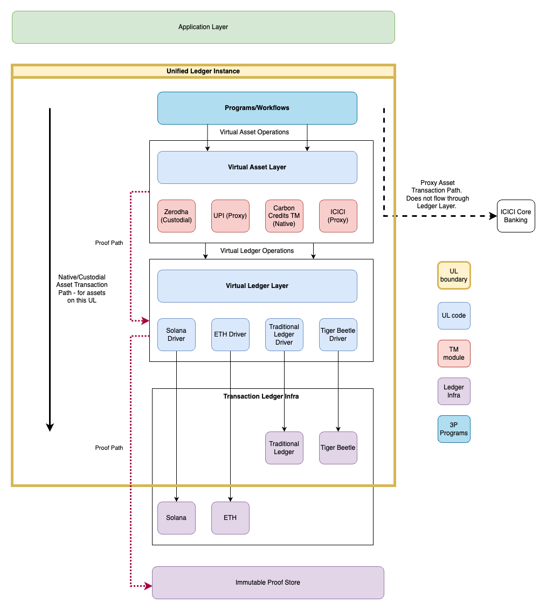

# UL - Overall system architecture

This document attempts a high-level system architecture of Unified Ledger to allow for diversity of
Assets, Token Managers and Ledger infrastructure.

Note:
Two topics that are not covered are user management/authentication/permissions -
they will be added in a subsequent iteration.

# Types of assets UL should support

Before getting into the system architecture - it is useful to broadly categorize
the different types of assets (based on their source of truth semantics) a UL
should support. This type of categorization will allow Token Managers with
varying degress of risk/functional appetite to onboard and also allow the UL to
clearly establish to the users who is managing their asset.  Based on this we
have categorized assets into the following:

- Native Asset
- Proxy Asset
- Custodial Asset

## Native Asset

These are assets which are fully handed over to the UL by the Token Manager - unlocks max flexibility as UL completely manages assets.

### UL responsibilities

- source of truth
- manage transactions
- publish proofs to Immutable Proof Store (IPS)

### Token Manager responsibilities

- Minimal role - can sign up for observing transactions

## Proxy Asset

These are assets where Token Manager is fully involved in all transactions (including view balances) and UL plays the role of proxy.

### UL responsibilities

- facilitate transactions
- publish proofs to Immutable Proof Store for transactions facilitated to Immutable Proof Store.

### Token Manager responsibilities

- Source of truth for asset
- Supports full UL Virtual Ledger interface

## Custodial Asset

These are types of assets where Token Manager wants UL to unlock faster
settlement from user-perspective but keep their source in sync. In this model
the Token Manager also guarantees that this asset is locked out at the Token
Manager end for any transactions as long UL has the custody of the asset i.e.
Read/Write on UL, Read-Only on Token Manager Ledger).

### UL responsibilities

- source of truth
- facilitate transactions
- locks out asset on Token Manager
- publish proofs to Immutable Proof Store for transactions facilitated to Immutable Proof Store.

### Token Manager responsibilities

- source of truth
- support locking of assets out of transaction (except on the UL)
- consume updates from UL (asynchronous mostly) to maintain consistency

## Sub-system mapping

Based on the above types of assets, we have attempted to define the overall
system architecture of the Unified Ledger. To do this, we have turned to the
Linux file-system for inspiration. In Linux everything is treated as a file.
The Linux filesystem supports a wide variety of files on a wide variety of
filesystems stored on a wide variety of devices. In short, it is a
demonstration of a model that provides diversity at multiple levels. In the UL
land - the requirement is to support a variety of
assets/credendentials/documents supported by various token managers on a variety
of ledger infra.

The following diagram attempts to show-case such a layered approach to the
Unified Ledger system.

<picture>
  <source media="(prefers-color-scheme: dark)" srcset="./assets/block-diagram-dark.png">
  
</picture>
<!--  -->

## Key components

- Application layer - this is the layer where programs/higher level asset workflows are written
- Program/Workflow layer - Asset Program/Workflows that a Unified Ledger supports - could as simple as transfer or a complicated basket of assets transfer
- Virtual Asset layer - this is the layer that offers a uniform interface to operate on assets across different asset types and different token managers
- Virtual Ledger layer - this is the layer that offers a uniform interface to use any ledger infrastructure as the underlying store of assets/contracts.

| Operating System    | Unified Ledger          |
| ------------------- | ----------------------- |
| Kernel              | Core UL                 |
| VFS                 | Virtual Asset Layer     |
| Specific Filesystem | Token Manager impl      |
| Device Driver Layer | Virtual Ledger Layer    |
| Device Driver       | Ledger infra impl       |
| Hard Disk           | Ledger Infra / Database |
| Process             | Program/Workflows       |

# Asset Schema and Functional Interface

The inode construct forms the inspiration for the asset schema and the syscall
interface forms the inspiration for the foundational functions that operate on
assets. While we have not included credentials and documents under the scope for
now - we believe they can have similar parallels. A later iteration of the
document will address those use-cases.

## Asset Record - The Inode of the Assets world

Taking inspiration from the inode primitive in the Linux eco-system, we have
come up with a potential struct for the asset_record. Following is the summary
of what kind of information is captured in the asset_record.

1. Asset Types (analogous to file types):

   - Modeled after the document's discussion of Real World Assets (RWA)
   - Includes physical and digital asset types
   - Supports flags for transferability, divisibility, and regulatory status

2. Metadata Fields:

   - Captures ownership (similar to uid/gid in inode)
   - Tracks creation, transfer, and verification times
   - Includes references to schemas, profiles, and authorizations

3. Flags and Status:

   - Represents asset lifecycle and compliance states
   - Allows for tokenization, locking, verification flags

4. Network and Transfer Metadata:

   - Reflects the cross-network transfer concepts in the original document
   - Tracks origin network and permitted transfer networks

5. Cryptographic Integrity:
   - Includes signature field for record verification
   - Supports the document's emphasis on verifiable, signed records

Key differences from traditional inode:

- Value-centric instead of storage-centric
- More extensive metadata about asset origin and transferability
- Explicit support for fractional ownership
- Compliance and regulatory metadata

<details>
<summary>Asset Record Struct Declaration: inspired by Inode</summary>

```c
// Asset representation structure inspired by inode and asset schema management concepts

struct asset_record {
    // Unique identification
    unsigned long a_id;                     // Unique asset identifier
    enum asset_type a_type;                 // Type of asset

    // Ownership and access control
    unsigned int a_owner_uid;               // User ID of primary owner
    unsigned int a_owner_gid;               // Group ID associated with asset
    unsigned int a_creator_uid;             // User ID of asset creator

    // Asset value and metadata
    unsigned long long a_value;             // Monetary value (in smallest currency unit)
    unsigned long long a_total_supply;      // Total supply if fractional
    unsigned long long a_circulating_supply; // Currently available supply

    // Temporal metadata
    unsigned long a_creation_time;          // Time asset was first recorded
    unsigned long a_last_transfer_time;     // Time of most recent transfer
    unsigned long a_verification_time;      // Time of last verification

    // Schema and profile references
    char *a_schema_ref;                     // Reference to asset definition schema
    char *a_profile_ref;                    // Reference to specific asset profile

    // Authorization and compliance
    char *a_issuance_auth_ref;              // Reference to token issuance authorization
    char *a_record_authority_ref;           // Reference to asset record authority

    // Asset-specific flags
    enum asset_flags a_flags;               // Status and lifecycle flags

    // Network and transfer metadata
    char *a_origin_network;                 // Network of asset origin

   // Extensibility
    void *a_private;                        // Private data for specific asset types

    // Cryptographic integrity
    unsigned char a_signature[64];          // Digital signature of asset record

    // Compliance and regulatory metadata
    unsigned int[*] a_jurisdiction;            // Jurisdiction identifiers

    enum asset_compliance_flags a_compliance_flags;       // Regulatory compliance indicators

    char **a_permitted_networks;            // Networks where asset can be transferred
    size_t a_network_count;                 // Number of permitted networks

    void *a_credentials;                    // Linked verifiable credentials
    void *a_presentations;                  // Linked verifiable presentations
};


// Enum for asset types (analogous to file types in inode)
enum asset_type {
    // Primary asset types
    ASSET_TYPE_COMMODITY    = 0x10000,  // Physical commodities (e.g., gold, oil)
    ASSET_TYPE_FINANCIAL    = 0x20000,  // Financial instruments
    ASSET_TYPE_INTELLECTUAL = 0x30000,  // IP, patents, copyrights
    ASSET_TYPE_REAL_ESTATE  = 0x40000,  // Property, land
    ASSET_TYPE_DIGITAL      = 0x50000,  // Digital-only assets (artwork, tokens)

    // Asset subtype flags
    ASSET_SUBTYPE_TRANSFERABLE  = 0x0001,  // Can be transferred between networks
    ASSET_SUBTYPE_DIVISIBLE     = 0x0002,  // Can be partially owned
    ASSET_SUBTYPE_REGULATED     = 0x0004,  // Subject to regulatory constraints

    // Locality of asset
    ASSET_LOCALITY_LOCAL    = 0x01000, // Asset is local to this network
    ASSET_LOCALITY_REMOTE   = 0x02000,  // Asset can be transferred between networks
};

// Enum for asset lifecycle and status flags
enum asset_flags {
    ASSET_FLAG_TOKENIZED        = 0x00000001,  // Asset has been tokenized
    ASSET_FLAG_LOCKED           = 0x00000002,  // Asset transfer is temporarily restricted
    ASSET_FLAG_VERIFIED         = 0x00000004,  // Asset ownership and origin verified
    ASSET_FLAG_FRACTIONALIZED   = 0x00000008,  // Asset has been split into smaller units
    ASSET_FLAG_ENCUMBERED       = 0x00000010,  // Asset has legal restrictions
};

// Compliance flags for representing regulatory and legal constraints
enum asset_compliance_flags {
    // Jurisdictional Compliance Flags
    COMPLIANCE_KYC_REQUIRED       = 0x00000001,  // Know Your Customer verification needed
    COMPLIANCE_AML_CHECKED        = 0x00000002,  // Anti-Money Laundering check completed
    COMPLIANCE_ACCREDITED_ONLY    = 0x00000004,  // Only accredited investors can hold
    COMPLIANCE_RESTRICTED_TRANSFER = 0x00000008,  // Transfers have additional restrictions

    // Investor Restrictions
    COMPLIANCE_QUALIFIED_INVESTOR = 0x00000010,  // Requires qualified investor status
    COMPLIANCE_MINIMUM_HOLDING    = 0x00000020,  // Minimum holding period required
    COMPLIANCE_MAX_OWNERSHIP      = 0x00000040,  // Caps on individual/entity ownership

    // Regulatory Classification
    COMPLIANCE_SECURITIES_ACT     = 0x00000100,  // Complies with Securities Act
    COMPLIANCE_COMMODITY_REG      = 0x00000200,  // Meets commodity trading regulations
    COMPLIANCE_TAX_REPORTABLE     = 0x00000400,  // Requires specific tax reporting

    // Geographic Restrictions
    COMPLIANCE_US_ACCREDITED      = 0x00001000,  // Complies with US accredited investor rules
    COMPLIANCE_EU_MiFID           = 0x00002000,  // Complies with EU Markets in Financial Instruments Directive
    COMPLIANCE_CROSS_BORDER_LIMIT = 0x00004000,  // Has cross-border investment limitations

    // Special Condition Flags
    COMPLIANCE_FROZEN             = 0x00010000,  // Asset temporarily frozen due to legal issue
    COMPLIANCE_LITIGATION_HOLD    = 0x00020000,  // Subject to ongoing legal proceedings
    COMPLIANCE_TAX_LIEN           = 0x00040000,  // Has outstanding tax obligations

    // Specific Industry Regulations
    COMPLIANCE_REAL_ESTATE_REG    = 0x00100000,  // Meets real estate investment regulations
    COMPLIANCE_COMMODITY_TRADING  = 0x00200000,  // Complies with commodity trading rules
    COMPLIANCE_INTELLECTUAL_PROP  = 0x00400000,  // Meets intellectual property transfer regulations
};
```

For assets that are represented as inodes, the following structure can define the access control mechanism for the asset.

```rust

/// Represents who the access control entry applies to
#[derive(Debug, Clone, PartialEq)]
pub enum AaceTagType {
    Owner,
    Group,
    User,
    TokenManager,
    Everyone,
}

/// Identifier for different types of entities
#[derive(Debug, Clone)]
pub enum AaceId {
    UserId(u32),
    GroupId(u32),
    TokenManagerId(String),
}

/// Permission masks for asset operations
#[derive(Debug, Clone, PartialEq)]
pub enum AacePerms {
    // Basic permissions
    View       = 1 << 0,  // Can view asset details
    Transfer   = 1 << 1,  // Can transfer asset
    Modify     = 1 << 2,  // Can modify asset metadata
    Lock       = 1 << 3,  // Can lock/unlock asset

    // Advanced permissions
    Tokenize   = 1 << 4,  // Can tokenize asset
    Fraction   = 1 << 5,  // Can fractionalize asset
    Delegate   = 1 << 6,  // Can delegate permissions

    // Administrative permissions
    Admin      = 1 << 7,  // Can change ACLs
    Verify     = 1 << 8,  // Can verify asset
    Destroy    = 1 << 9,  // Can destroy asset

    // Token Manager specific
    Custody    = 1 << 10, // Can take custody
    Validate   = 1 << 11, // Can validate transactions
    Observe    = 1 << 12, // Can observe transactions
}

bitflags! {
    /// Flags that modify entry behavior
    pub struct AaceFlags: u32 {
        const INHERIT           = 0b00000001; // Inherit to derived assets
        const NO_PROPAGATE      = 0b00000010; // Don't propagate further
        const AUDIT_SUCCESS     = 0b00000100; // Log successful access
        const AUDIT_FAILURE     = 0b00001000; // Log failed access
        const TEMPORARY         = 0b00010000; // Temporary permission
        const RESTRICTED        = 0b00100000; // Restricted by compliance
    }
}

/// Additional constraints for access control
#[derive(Debug, Clone)]
pub struct AaceConstraints {
    pub start_time: time::SystemTime,       // When permission becomes valid
    pub end_time: time::SystemTime,         // When permission expires
    pub max_value: u64,                     // Maximum transaction value
    pub max_uses: u32,                      // Maximum number of uses
    pub jurisdiction: u32,                  // Jurisdiction where valid
}

/// Asset Access Control Entry
#[derive(Debug, Clone)]
pub struct Aace {
    pub tag: AaceTagType,
    pub id: AaceId,
    pub permissions: Vec<AacePerms>,
    pub flags: AaceFlags,
    pub constraints: AaceConstraints,
}

/// Asset Access Control List
#[derive(Debug, Clone)]
pub struct Aacl {
    pub count: u32,
    pub flags: AaceFlags,
    pub entries: Vec<Aace>,
}

```

</details>

## Functional primitives aka Virual Asset Operations (aka Syscalls)

The following section describes potential functional primitives that higher
level applications will need to perform operations on the assets. These
functional primitives are supported by the Virtual Asset Layer.

```c

enum IntentPurpose {
    O_DEBIT = 1,
    O_CREDIT = 2,
    O_CREATE = 4,
    O_TRUNCATE = 8,
    O_READ = 16,
};

```

### intend

This is analogous to the open system call indicating the user's intent to perform an operation.

```c
intent_d intend(void* asset_id, uint32_t intent); // intent is a bitmask of the operations that the user wants to perform
```

### `done`

This is similar to the `close` syscall in linux

```c
int done(intent_d intent); // it can error out
  `
```

### transfer

This is the functional primitive to perform transfers between a debit and a credit intent.

```c
int transfer(intent_d from, intent_d to, uint32_t units); // it can error out
```

### view

This is a functional primitive that can be used to retrieve balance for that
particular asset.

```c
int view(intent_d intent); // it can error out
```

### load_module

This can be associated with adding support for a new asset on the system (or onboarding a remote asset)

```c
int load_module(char* module_path);
```

### debit / credit

We are unsure at this moment if the underlying debit/credit operations should be exposed to
programs at all.

> `debit`
>
> ```c
> int debit(intent_d intent, uint32_t units); // it can error out
> ```
>
> `credit`
>
> ```c
> int credit(intent_d intent, uint32_t units); // it can error out
> ```

## Asset programmability via event driven hooks

`eBPF` (extended Berkeley Packet Filter) is a powerful and flexible mechanism that provides us with an ability to attach programs to various hooks in the kernel. This allows us to run custom programs in response to events in the kernel. On the same note, having a mechanism that allows the users/token managers to attach programs that can be executed around the syscalls (`on_start`, `on_end`, `on_error`) can be a powerful tool to extend the capabilities of the UL.

The `attach_program` syscall is used to this set this up.

```c
int attach_program(char* path, char* hook, char* code);
```

These programs can provide validation, logging, and other custom logic around the syscalls for both the token managers and the users. Functionalities like, `amount` validation before a transfer, ability to track high valued transaction for the banks and other auditability features can be implemented using this mechanism.

The permissions for attaching the program are based on the owner of the program. If the owner is a user, the program can only be attached to the assets owned by the user. If the owner is a token manager, the program can be attached to the assets managed by the token manager.

## Other syscall equivalents

- `unload_module` this can be associated with deleting an asset from the system (or offboarding a remote asset)
- `mod_resolv` Resolve the module to be used for performing fundamental operations on a specific asset.
- `mount` Mount a local/remote asset management system to finternet
- `unmount` Unmount a local/remote asset management system from finternet
- `useradd` Add a new user to the system
- `usermod` Modify an existing user
- `userdel` Delete a user from the system
- `chmod` Change the permissions of an asset

# Addressing scheme

There are three key entities/personas in the Finternet. The UL itself which is
the platform, the asset/token managers and the end-users. It is important that
there is a unambiguous and global addressing scheme for each of the entities.
One option to do so is to use the path approach of the Linux file-system to
addressing these entities.

The first component refers to the UL itself. For e.g. if we have tech companies
like Google/Microsoft implementing the UL, the address might look like:

- `finternet://google-unified-ledger/`
- `finternet://microsoft-unified-ledger/`

The second component establishes the namespace for the other two entities in the
system i.e. asset/token-managers and users.

- `finternet://google-unified-ledger/asset-managers`
- `finternet:/google-unified-ledger/users`
- `finternet://microsoft-unified-ledger/asset-managers`
- `finternet://microsoft-unified-ledger/users`

Specific token-manager and users can be referred under the above namespaces
respectively:

- `finternet://google-unified-ledger/asset-managers/icici`
- `finternet://google-unified-ledger/users/user1`
- `finternet://microsoft-unified-ledger/asset-managers/chase`
- `finternet://microsoft-unified-ledger/users/user2`

# Example Workflows

The following section covers an imagination of a new asset/token manager module
(for a couple of use-cases) is added to the system and how the underlying
primitive calls can be invoked to compose a transaction.

## User Onboarding

When a user (user1) signs up with a particular UL provider (say
`ul-provider-1`), the equivalent of the `useradd` in a Linux system happens.

```sh
useradd user1
```

This will result in the `finternet://ul-provider-1/users/{user1}/` namespace/directory created.

## Money

### Boot Steps

```c

wget https://npci.org.in/upi/rtp/mod -o upi.rtp.mod

load_module("upi.rtp.mod");
mount("india.upi.rtp", "finternet://ul-provider-1/asset-managers/upi");
```

### User account linking

User links their UPI account into this UL provider.

```c
symlink("finternet://ul-provider-1/upi/alice@okicici", "finternet://ul-provider-1/users/alice/upi-1");

```

### Transaction program

```c


void icici_account_transfer(char* from_upi_id, char* to_upi_id, uint32_t amount) {
    intent_id intent_from = intend(sprintf("finternet://ul-provider-1/users/alice/vpa-1", from), O_DEBIT);

    // other possible variant
    // intent_id intent_from = intend(sprintf("finternet://ul-provider-1/upi/alice@okicici", from), O_DEBIT);
    intent_id intent_to = intend(sprintf("finternet://ul-provider-1/asset-managers/upi/%s", to), O_CREDIT);

    int exit_code = transfer(intent_from, intent_to, amount);

    if (exit_code == 0) {
        printf("Transfer successful\n");
    } else {
        printf("Transfer failed\n");
    }

    done(intent_from);
    done(intent_to);
}

```

## Securities

### Boot Steps

```c

wget https://zerodha.nsdl.sec.mod -o zerodha.sec.mod

load_module("zerodha.sec.mod");
mount("india.zerodha.sec", "finternet://ul-provider-1/asset-managers/zerodha");

```

### User account linking

User links their Depository Participant account into this UL provider.

```c
symlink("finternet://ul-provider-1/zerodha/alice-dp-id-1", "finternet://ul-provider-1/users/alice/dp-id-1");

```

### Transaction program

```c
void sell_securities(char* dp_id, char* exchange, char* isin, uint32_t quantity) {
    intent_id intent_from = intend(sprintf("finternet://ul-provider-1/asset-managers/zerodha/%s/%s", dp_id, isin), O_DEBIT);
    intent_id intent_to = intend(sprintf("finternet://ul-provider-1/asset-managers/zerodha/nsdl/%s/%s", exchange, isin), O_CREDIT);
    int exit_code = transfer(intent_from, intent_to, quantity);

    if (exit_code == 0) {
        printf("Transfer successful\n");
    } else {
        printf("Transfer failed\n");
    }

    done(intent_from);
    done(intent_to);
}

void buy_securities(char* dp_id, char* exchange, char* isin, uint32_t quantity) {
    intent_id intent_from = intend(sprintf("finternet://ul-provider-1/asset-managers/zerodha/nsdl/%s/%s", exchange, isin), O_DEBIT);
    intent_id intent_to = intend(sprintf("finternet://ul-provider-1/asset-managers/zerodha/%s/%s", dp_id, isin), O_CREDIT);
    int exit_code = transfer(intent_from, intent_to, quantity);

    if (exit_code == 0) {
        printf("Transfer successful\n");
    } else {
        printf("Transfer failed\n");
    }

    done(intent_from);
    done(intent_to);
}
```

## Fractionalized Assets

### Boot Steps

```c
wget https://bbmp.org.in/land/mod -o bbmp.land.mod

load_module("bbmp.land.mod");
mount("india.bbmp.land", "finternet://ul-provider-1/asset-managers/bbmp");
```

### Transaction program

```c

void make_fractions(char* land_id) {
    intent_id intent_from = intend(sprintf("finternet://ul-provider-1/asset-managers/bbmp/%s", land_id), O_READ);
    intent_id intent_to_1 = intend(sprintf("finternet://ul-provider-1/asset-managers/bbmp/%s.%d", land_id, 1), O_CREATE);
    intent_id intent_to_2 = intend(sprintf("finternet://ul-provider-1/asset-managers/bbmp/%s.%d", land_id, 2), O_CREATE);
}

```

## User Account Organization

Users can create `directories` under their namespace to organize accounts. They
can move all upi accounts into one directory.

```c
mkdir("finternet://ul-provider-1/users/alice/upi-accounts/");
rename("finternet://ul-provider-1/users/alice/upi-1", "finternet://ul-provider-1/users/alice/upi-accounts/")
```
