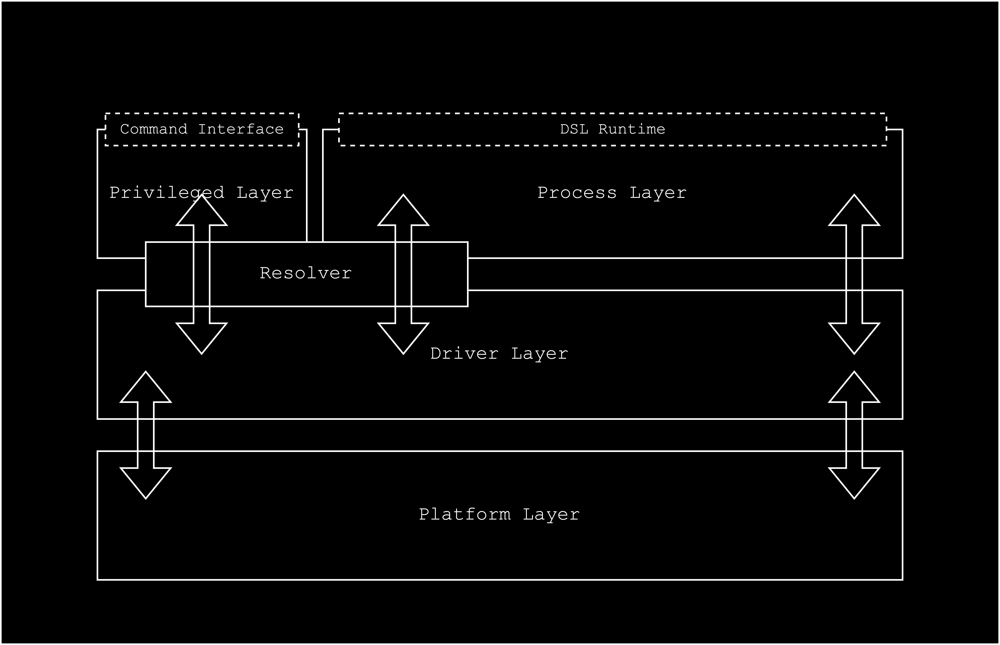

## Design

### Architecture

This system is a three-tier architecture. _(burger architecture)_

1.  **Process Layer**

    This layer provides a direct abstraction for the users to interact with the system. Whenever the user runs a workflow (process) (i.e. in our case a wasm module). The user is provided with a VAL (Virtual Asset Layer) which allows for accessing functions from the driver layer. The appropriate driver to use is desided based on the identifier used inside the workflow. The identifier is passed to a resolver, that resolves it to an appropriate driver. Once an asset is being accessed, the resolver provides a descriptor that can be used along with the user context to invoke the functionality exposed by the driver. The code executed by the resolver to provide the descriptor is divided into two parts:

    - The first part identifies the driver to use based on the identifier.
    - The second part executes the drivers `intend` function, to generate the descriptor.

2.  **Driver Layer**

    This layer is an intermediary between the platform layer and the process layer. The provides the data a meaning, that can be used and understood by the process layer. It also handles the user context, and provides permissioned access to the data that is being requested/modified/created. Similar to linux kernel, drivers are loaded by external entities into the runtime during it's execution. They are dynamically loaded and unloaded. The drivers implement the functions present in the VAL. Making them generic and reusable across different workflows. They are installed into the system as modules, by a token manager. This is also part of the command interface, but it requires specific permissions to install a driver.

3.  **Platform Layer**

    This is the lowest layer of the system. This provides abstraction that are exposed inside the driver runtime, allowing driver to interact with various low-level components and services. When the drivers are accessing this layer, they provide a driver specific context, which is used to maintain boundaries between different drivers. This is done to prevent drivers from accessing data that they are not supposed to access. This are implemented directly into the runtime, and cannot be modified or overwritten. They cannot be accessed by the user directly, and are only accessible by the drivers.
