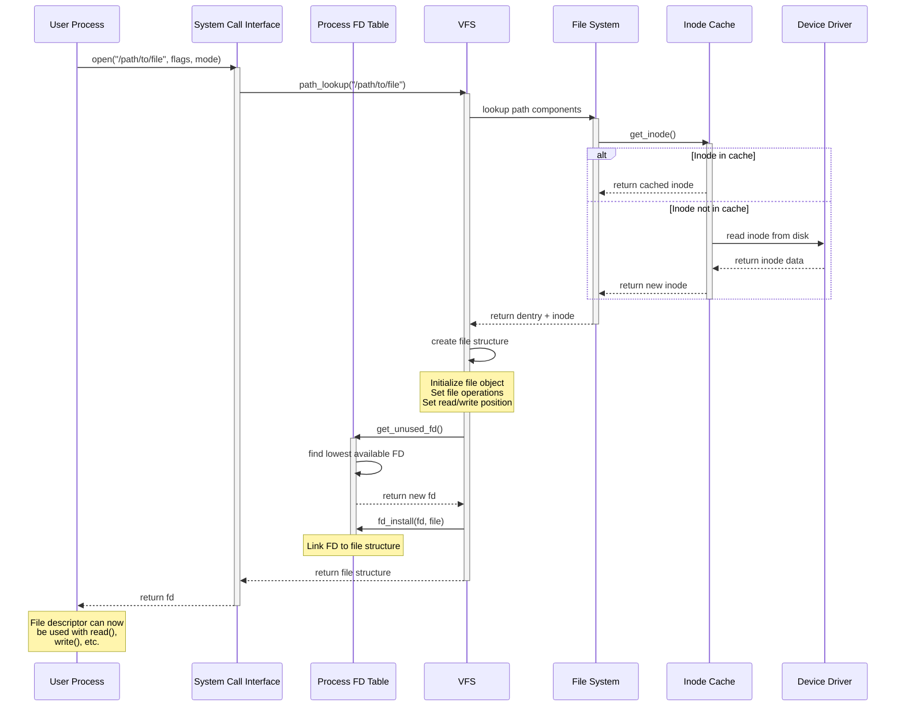
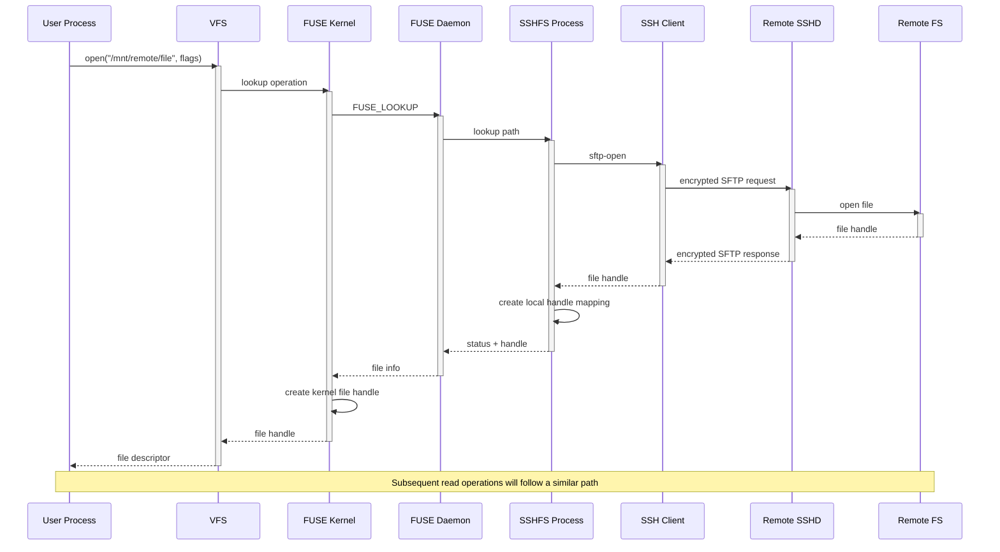
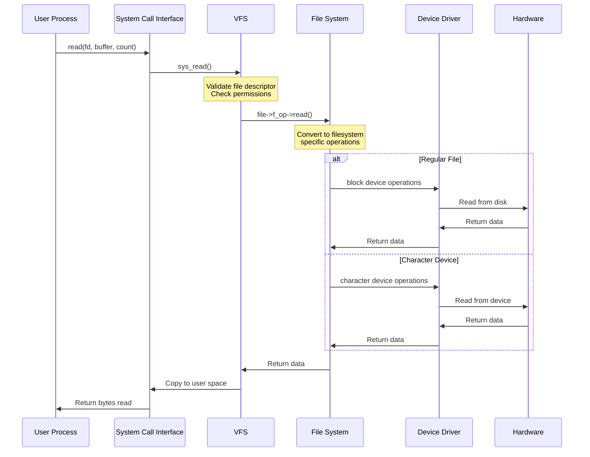
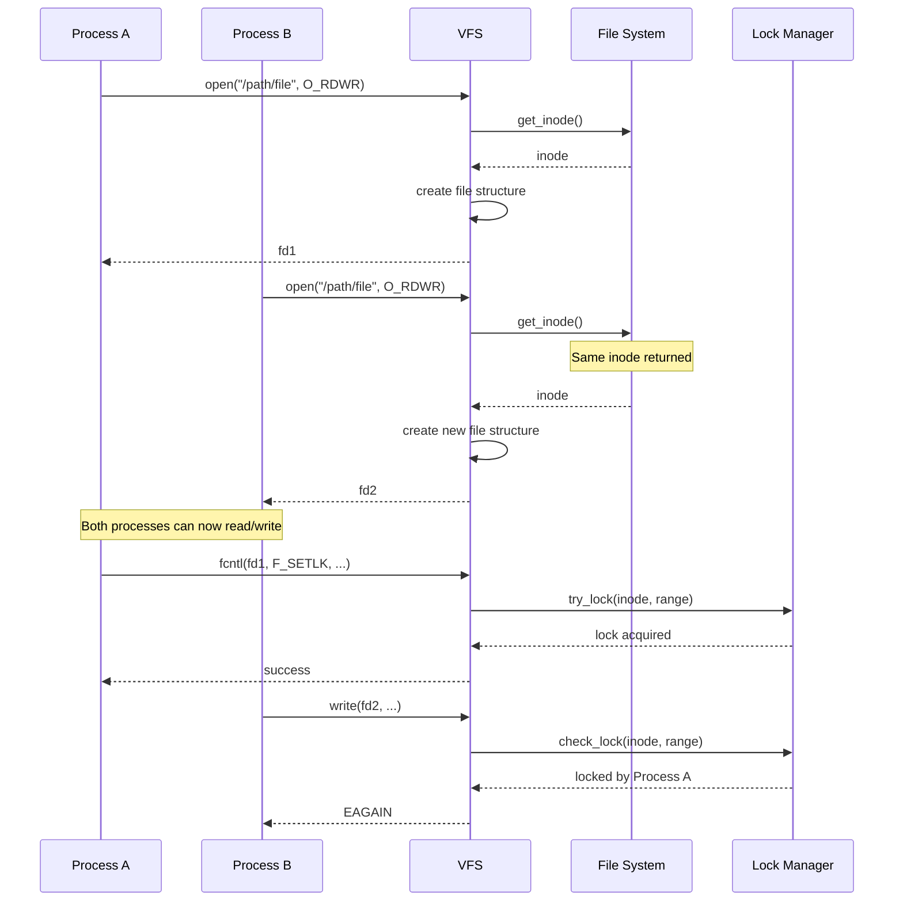
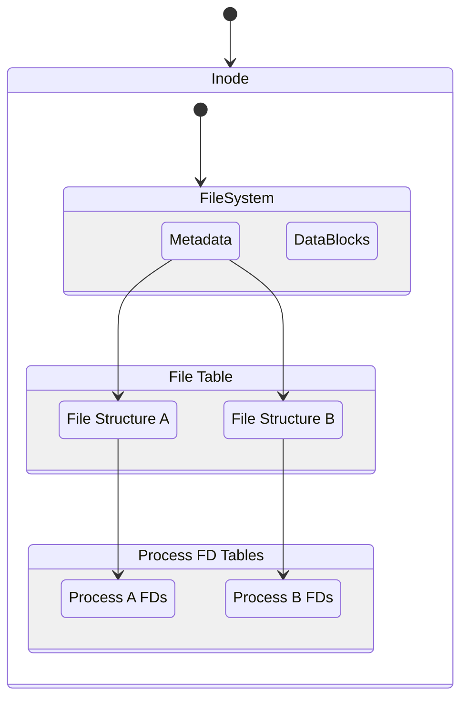
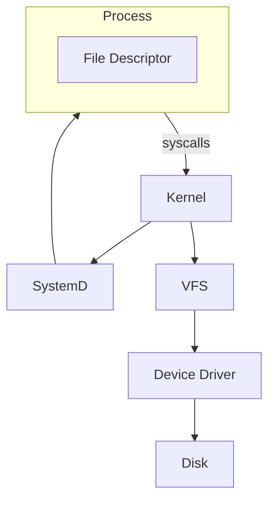

## Get File Descriptor (Local Resources)

## Open Life Cycle (Remote Resources)

### Read Life Cycle

---
### Knowledge

How multiple file descriptors can exist at the same time?

### Notes

Type of Locks
- Advisory Locks (flock)
- Mandatory Locks
- Read/Write Locks

- The kernel doesn't enforce locking, it's something that is done by the applications explicitly
- The access remote file there is FUSE deamon

- File Descriptor -> File Handle -> (inode, filesystem) -> driver specific syscalls.

